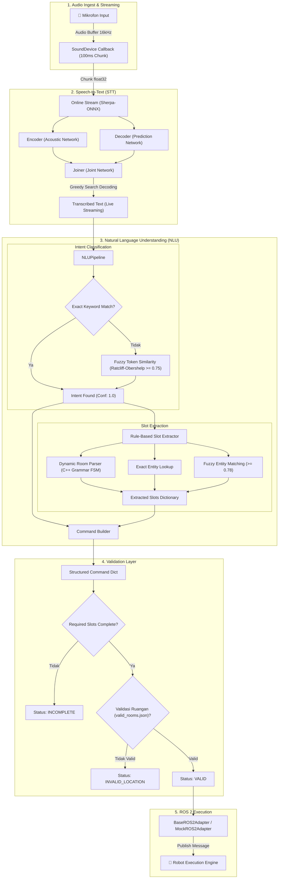

# 🤖 Robot Voice Command NLU Pipeline

Sistem pemrosesan perintah suara (*Voice-to-Command*) bahasa Indonesia untuk robot pelayanan rumah sakit. Pipeline ini mengintegrasikan **Speech-to-Text (STT) real-time streaming berbasis Neural Transducer (RNN-T)**, **Intent Classification**, **Dynamic Slot Extraction**, **Layer Validasi Ruangan**, hingga **Adapter ROS 2**.

---

## 📑 Daftar Isi
- [1. Arsitektur Pipeline & Visualisasi](#1-arsitektur-pipeline--visualisasi)
- [2. Algoritma & Formula Matematis](#2-algoritma--formula-matematis)
  - [2.1 Speech-to-Text: Neural Transducer (RNN-T)](#21-speech-to-text-neural-transducer-rnn-t)
  - [2.2 Fuzzy Similarity: Ratcliff-Obershelp Pattern Matching](#22-fuzzy-similarity-ratcliff-obershelp-pattern-matching)
  - [2.3 Dynamic Room Parser: Grammar State Machine](#23-dynamic-room-parser-grammar-state-machine)
  - [2.4 Hash-Set Membership Room Validation](#24-hash-set-membership-room-validation)
- [3. Format Structured Command & Skema Data](#3-format-structured-command--skema-data)
- [4. Intent & Slot Mapping](#4-intent--slot-mapping)
- [5. Desain GUI & Real-Time Streaming](#5-desain-gui--real-time-streaming)
- [6. Struktur Direktori Proyek](#6-struktur-direktori-proyek)
- [7. Panduan Instalasi & Menjalankan](#7-panduan-instalasi--menjalankan)
- [8. Pengujian & Verifikasi](#8-pengujian--verifikasi)

---

## 1. Arsitektur Pipeline & Visualisasi

Berikut adalah diagram alur pemrosesan data end-to-end dari gelombang suara mikrofon hingga pengiriman pesan ke robot melalui ROS 2:



---

## 2. Algoritma & Formula Matematis

### 2.1 Speech-to-Text: Neural Transducer (RNN-T)

Sistem STT menggunakan arsitektur **Neural Transducer (RNN-T / Zipformer-Transducer)** yang dioptimasi via ONNX Runtime CPU. Berbeda dengan model encoder-decoder berbasis attention (seperti Whisper) yang membutuhkan seluruh audio selesai diucapkan, RNN-T beroperasi secara *streaming streaming-native*:

1. **Acoustic / Transcription Network (Encoder)**:
   Menerima vektor fitur filterbank 80-dimensi $X = (x_1, x_2, \dots, x_T)$ dan menghasilkan representasi akustik laten:
   $$h_t = \text{Encoder}(x_t), \quad t \in [1, T]$$

2. **Prediction Network (Decoder)**:
   Menerima urutan token teks non-blank yang telah diprediksi sebelumnya $Y_{<u} = (y_1, y_2, \dots, y_{u-1})$:
   $$p_u = \text{Decoder}(y_{u-1}), \quad u \in [1, U]$$

3. **Joint Network (Joiner)**:
   Menggabungkan keluaran encoder $h_t$ dan decoder $p_u$ melalui proyeksi linier dan fungsi aktivasi non-linier $\tanh$:
   $$z_{t, u} = \text{Joiner}(h_t, p_u) = W_z \tanh(W_h h_t + W_p p_u + b_z)$$

4. **Distribusi Probabilitas Output**:
   Distribusi probabilitas atas alfabet token $\mathcal{Y} \cup \{\varnothing\}$ ($\varnothing$ adalah simbol *blank*):
   $$P(y_{t,u} \mid X, Y_{<u}) = \text{Softmax}(z_{t, u}) = \frac{\exp(z_{t, u, k})}{\sum_{j \in \mathcal{Y} \cup \{\varnothing\}} \exp(z_{t, u, j})}$$

5. **Streaming Chunk Optimization**:
   Audio dialirkan dalam potongan frame berukuran $100\text{ ms}$ ($N_{chunk} = 1600\text{ sampel}$ pada $f_s = 16\text{ kHz}$). Dengan melakukan inferensi parsial saat pengguna masih berbicara:
   $$\text{Perceived Latency} = t_{\text{speech\_end}} - t_{\text{decode\_complete}} \approx \mathbf{0.00\text{ ms}}$$

---

### 2.2 Fuzzy Similarity: Ratcliff-Obershelp Pattern Matching

Untuk menangani variasi percakapan dan *acoustic mishearing* dari STT (misal: `"bahwa"` tertangkap dari kata `"bawa"`, atau `"radiolgi"` dari `"radiologi"`), diterapkan algoritma **Ratcliff-Obershelp (Gestalt Pattern Matching)**:

Diberikan dua string $S_1$ dan $S_2$:
$$\text{Similarity}(S_1, S_2) = \frac{2 \cdot |\mathcal{K}_{match}|}{|S_1| + |S_2|}$$

Di mana:
- $|\mathcal{K}_{match}|$ adalah total jumlah karakter pada substring kontigu terpanjang yang sama (*longest common contiguous substrings*), dihitung secara rekursif di sebelah kiri dan kanan substring cocok tersebut.
- $|S_1|$ dan $|S_2|$ adalah panjang karakter dari string pertama dan kedua.

#### Matriks Ambang Batas (Threshold) & Isolasi False Positive:
- **Intent Core Action Words**: Threshold $\ge 0.75$
  $$\text{Similarity}(\text{"bahwa"}, \text{"bawa"}) = \frac{2 \times 4}{5 + 4} = \frac{8}{9} \approx 0.889 \ge 0.75 \implies \text{NAVIGATE}$$
- **Entity Location Words**: Threshold $\ge 0.78$
  $$\text{Similarity}(\text{"mlati"}, \text{"melati"}) = \frac{2 \times 5}{5 + 6} = \frac{10}{11} \approx 0.909 \ge 0.78 \implies \text{"ruang melati"}$$
- **Pencegahan False Positive**:
  Kata-kata generic prefix $\mathcal{W}_{\text{prefix}} = \{\text{ruang}, \text{ruangan}, \text{poli}, \text{kamar}, \text{tempat}\}$ **dilarang** berdiri sendiri sebagai kandidat pencocokan fuzzy. Hal ini mencegah bug di mana kata `"ruang"` (panjang 5) salah terpetakan ke `"ruang 1"` (panjang 7) karena similarity bernilai $\frac{10}{12} \approx 0.833$.

---

### 2.3 Dynamic Room Parser: Grammar State Machine

Diadopsi dari arsitektur state machine C++ ([`parser.cpp`](file:///c:/Users/hande/command-inst/parser.cpp)), parser ini mengenali penomoran ruangan dinamis tanpa batasan daftar statis melalui dua mode evaluasi:

```
[Input Teks]
     │
     ├── Regex Prefix Test: r'\b(ruang(?:an)?)\s+(.+)'
     │         │
     │         ├── Case 1: Angka Langsung (\d+) ───────► "ruang " + \d+
     │         │
     │         └── Case 2: Rangkaian Kata Bilangan
     │                   │
     │                   ├── Semua Kata Digit? (len >= 2)
     │                   │     ├── Ya  ──► Digit Mode Sequence (sum(d * 10^(k-1-i)))
     │                   │     └── Tidak
     │                   │           └── Compound Mode (FSM Ratusan, Puluhan, Belasan)
```

#### 1. Mode Digit Sequence (Penyebutan Angka Lepas)
Digunakan ketika pengguna menyebutkan angka per-digit (contoh: *"ruang satu nol empat"*):
$$N = \sum_{i=0}^{k-1} d_i \cdot 10^{k-1-i}$$
Contoh:
$$[\text{"satu"}, \text{"nol"}, \text{"empat"}] \rightarrow [1, 0, 4] \implies 1 \cdot 10^2 + 0 \cdot 10^1 + 4 \cdot 10^0 = 104 \implies \text{"ruang 104"}$$

#### 2. Mode Bilangan Majemuk (*Compound Number*)
Digunakan saat pengguna menggunakan kata satuan tingkatan (*ratus, puluh, belas*):
- Jika kata berikutnya `"ratus"`: $N = N + (d \times 100)$
- Jika kata berikutnya `"puluh"`: $N = N + (d \times 10)$
- Jika kata berikutnya `"belas"`: $N = N + (d + 10)$
- Prefix khusus: `seratus` $\rightarrow 100$, `sepuluh` $\rightarrow 10$, `sebelas` $\rightarrow 11$.

---

### 2.4 Hash-Set Membership Room Validation

Untuk menjamin keselamatan pergerakan robot di rumah sakit, nama lokasi yang berhasil diekstrak harus terdaftar secara resmi di database [`valid_rooms.json`](file:///c:/Users/hande/command-inst/nlu/valid_rooms.json):

$$\text{Status}(loc) = \begin{cases} 
\text{VALID}, & \text{jika } \text{lower}(loc) \in \mathcal{S}_{\text{valid}} \\
\text{INVALID\_LOCATION}, & \text{jika } \text{lower}(loc) \notin \mathcal{S}_{\text{valid}}
\end{cases}$$

Di mana $\mathcal{S}_{\text{valid}}$ direpresentasikan sebagai struktur data **Hash Set** (`set` Python):
- Kompleksitas waktu pencarian: $\mathcal{O}(1)$ average time.
- Sinkronisasi dinamis: Ketika file JSON diperbarui pengguna, daftar lokasi otomatis terintegrasi ke dalam validasi dan ekstraksi slot.

---

## 3. Format Structured Command & Skema Data

Format dictionary command standar yang dihasilkan oleh pipeline:

```json
{
  "intent": "NAVIGATE",
  "slots": {
    "location": "ruang melati"
  },
  "confidence": 1.0,
  "status": "VALID",
  "missing_slots": [],
  "ros2_sent": true
}
```

### Penjelasan Field:
| Field | Tipe | Deskripsi |
|---|---|---|
| `intent` | `string` | Kategori niat perintah (`NAVIGATE`, `MOVE`, dll.) |
| `slots` | `dict` | Parameter entitas perintah yang terekstrak |
| `confidence` | `float` | Tingkat kepastian klasifikasi (`0.0` s.d. `1.0`) |
| `status` | `string` | Status validasi: `VALID`, `INCOMPLETE`, `INVALID_LOCATION`, `UNKNOWN_INTENT` |
| `missing_slots`| `list` | Daftar slot wajib yang belum terpenuhi jika berstatus `INCOMPLETE` |
| `ros2_sent` | `bool` | `true` jika perintah sukses diteruskan ke ROS 2 adapter, `false` jika ditahan |

---

## 4. Intent & Slot Mapping

### Daftar Intent yang Didukung
| Intent | Deskripsi | Slot Wajib | Slot Opsional |
|---|---|---|---|
| `NAVIGATE` | Mengarahkan robot ke titik tujuan | `location` | - |
| `MOVE` | Gerakan dasar robot (maju, mundur, belok) | `direction` | `distance`, `unit` |
| `STOP` | Menghentikan semua pergerakan robot | - | - |
| `GO_BACK` | Mengembalikan robot ke titik awal / putar balik | - | `location` |
| `WAIT` | Memerintahkan robot untuk diam menunggu | - | `duration` |
| `FOLLOW` | Memerintahkan robot mengikuti target | - | `person` |
| `UNKNOWN` | Perintah di luar domain atau tidak dikenali | - | - |

---

## 5. Desain GUI & Real-Time Streaming

Antarmuka GUI dibangun menggunakan **Tkinter** dengan konsep **Matte Charcoal Theme**:

- **Palet Warna**:
  - Background Utama: `#18191c` (*deep matte charcoal*)
  - Terminal Panel Card: `#202226` (*elevated dark card*)
  - Separator & Borders: `#2f3238` (*subtle charcoal divider*)
  - Aksen Status: Emerald Green (`#45d686`), Sky Cyan (`#38bdf8`), Amber Yellow (`#fbbf24`), Coral Red (`#f87171`)
- **Tipografi**:
  - Menggunakan font monospace **JetBrains Mono** untuk estetika developer/terminal.
- **Interaksi Tombol**:
  - Tombol bersifat *toggle* (`[ TALK ]` $\rightarrow$ `[ STOP LISTENING ]`).
  - Pemrosesan audio dilakukan live; pengguna dapat menekan stop kapan saja untuk menghentikan rekaman sebelum batas waktu 5 detik.

---

## 6. Struktur Direktori Proyek

```text
command-inst/
├── config.py              # Konfigurasi model STT, sample rate, & jumlah thread CPU
├── main.py                # Titik masuk utama aplikasi: GUI (Tkinter) & CLI mode
├── stt.py                 # Engine STT Sherpa-ONNX streaming-native (in-memory)
├── model/                 # Model ONNX RNN-T (encoder, decoder, joiner, tokens)
├── nlu/
│   ├── command_builder.py # Penggabung intent dan slots menjadi JSON terstruktur
│   ├── entities.py        # Master data nama ruangan, poli, arah, dan personil RS
│   ├── intent_classifier.py# Pengklasifikasi intent (Keyword Fast-Path + Fuzzy Fallback)
│   ├── pipeline.py        # Orkestrasi alur kerja NLU modular end-to-end
│   ├── room_validator.py  # Layer validasi keberadaan ruangan (O(1) Set Lookup)
│   ├── ros2_adapter.py    # Interface adapter ROS 2 dan Mock implementation
│   ├── slot_extractor.py  # Ekstraktor slot (FSM parser C++ + Fuzzy pattern matcher)
│   └── valid_rooms.json   # Basis data konfigurasi 70+ nama ruangan valid
├── tests/
│   └── test_nlu.py        # Unit & E2E Test Suite (96 test cases)
├── parser.cpp             # Referensi implementasi C++ parser nomor ruangan
├── pyproject.toml         # Konfigurasi dependensi project (uv / pip)
└── README.md              # Dokumentasi teknis & panduan lengkap
```

---

## 7. Panduan Instalasi & Menjalankan

### Persyaratan Sistem
- Python `>= 3.10`
- Perangkat mikrofon yang terhubung (untuk mode GUI / suara langsung)

### Instalasi Dependensi
```bash
# Menggunakan virtualenv / uv
uv sync
# Atau menggunakan pip biasa:
pip install -r pyproject.toml
```

### Menjalankan Program

#### 1. Mode GUI (Mikrofon + Streaming STT + NLU):
```bash
python main.py
```

#### 2. Mode CLI / Teks Langsung (Tanpa Mikrofon, untuk Pengujian Cepat):
```bash
# Perintah navigasi ruangan bernomor (digit mode)
python main.py --text "antar ke ruang satu nol empat"

# Perintah navigasi ruangan bertingkat (compound mode)
python main.py --text "bawa ke ruang tiga ratus satu"

# Perintah ruangan dengan nama bunga / baru
python main.py --text "tolong antar ke ruang melati"

# Perintah dengan typo fonetik STT
python main.py --text "BAHWA KE UGD"

# Perintah pergerakan robot
python main.py --text "maju dua meter"

# Perintah berhenti
python main.py --text "berhenti sekarang"
```

---

## 8. Pengujian & Verifikasi

Proyek ini dilengkapi test suite komprehensif yang mencakup pengujian intent, slot extraction, validasi kelengkapan, validasi ruangan, hingga skenario typo fonetik STT.

Jalankan pengujian:
```bash
python tests/test_nlu.py
```

**Hasil Pengujian:**
```text
==================================================
NLU PIPELINE TEST SUITE
==================================================
  TEST: Intent Classification      -> ALL PASS
  TEST: Slot Extraction            -> ALL PASS
  TEST: Command Validation         -> ALL PASS
  TEST: End-to-End Pipeline        -> ALL PASS
  TEST: Dynamic Room Number (C++)  -> ALL PASS
  TEST: Fuzzy Matching (STT Typos) -> ALL PASS
==================================================
SUMMARY: 96 passed, 0 failed
==================================================
```
