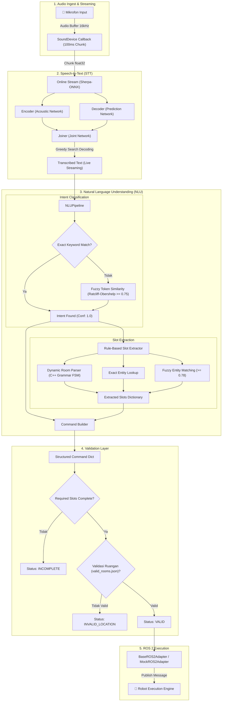

# 🤖 Robot Voice Command NLU Pipeline

Sistem pemrosesan perintah suara (*Voice-to-Command*) bahasa Indonesia untuk robot pelayanan rumah sakit. Pipeline ini mengintegrasikan **Speech-to-Text (STT) real-time streaming berbasis Neural Transducer (RNN-T)**, **Intent Classification**, **Dynamic Slot Extraction**, **Layer Validasi Ruangan**, hingga **Adapter ROS 2**.

---

## 📑 Daftar Isi
- [1. Arsitektur Pipeline & Visualisasi](#1-arsitektur-pipeline--visualisasi)
- [2. Algoritma & Formula Matematis](#2-algoritma--formula-matematis)
  - [2.1 Speech-to-Text: Neural Transducer (Zipformer RNN-T)](#21-speech-to-text-neural-transducer-zipformer-rnn-t)
  - [2.2 Fuzzy Similarity: Ratcliff-Obershelp Pattern Matching](#22-fuzzy-similarity-ratcliff-obershelp-pattern-matching)
  - [2.3 Dynamic Room Parser: Grammar State Machine (FSM)](#23-dynamic-room-parser-grammar-state-machine-fsm)
  - [2.4 Hash-Set Membership Room Validation](#24-hash-set-membership-room-validation)
  - [2.5 Middleware Interfacing: ROS 2 Publish-Subscribe Architecture](#25-middleware-interfacing-ros-2-publish-subscribe-architecture)
- [3. Format Structured Command & Skema Data](#3-format-structured-command--skema-data)
- [4. Intent & Slot Mapping](#4-intent--slot-mapping)
- [5. Desain GUI & Real-Time Streaming](#5-desain-gui--real-time-streaming)
- [6. Struktur Direktori Proyek](#6-struktur-direktori-proyek)
- [7. Panduan Instalasi & Menjalankan](#7-panduan-instalasi--menjalankan)
- [8. Pengujian & Verifikasi](#8-pengujian--verifikasi)

---

## 1. Arsitektur Pipeline & Visualisasi

Berikut adalah diagram alur pemrosesan data end-to-end dari gelombang suara mikrofon hingga pengiriman pesan ke robot melalui ROS 2:



---

## 2. Algoritma & Formula Matematis

### 2.1 Speech-to-Text: Neural Transducer (Zipformer RNN-T)

Sistem STT menggunakan arsitektur **Neural Transducer (RNN-T / Zipformer-Transducer)** yang dioptimasi via ONNX Runtime CPU. 

#### Mengapa Tidak Menggunakan Model Attention/Whisper?
Model speech-to-text generasi sebelumnya berbasis Attention Encoder-Decoder (seperti OpenAI Whisper) beroperasi secara *batch-offline*, di mana seluruh kalimat harus selesai diucapkan terlebih dahulu sebelum proses decoding dimulai. Hal ini menyebabkan jeda respon (*perceived latency*) sebesar 1–3 detik—sangat menghambat interaksi natural pada robot layanan. 

Sebaliknya, **RNN-T beroperasi secara *streaming-native***: audio diproses secara simultan saat suara masih mengalir ke mikrofon (*in-flight partial decoding*).

```
Audio Input (16 kHz) ──► 80-dim Filterbank ──► Acoustic Encoder (Zipformer) ──┐
                                                                              ├──► Joiner ──► Greedy Search ──► Live Text
Previous Non-Blank Tokens ───────────────────► Prediction Decoder (RNN/Stateless)┘
```

#### Formulasi Matematis:
1. **Acoustic / Transcription Network (Encoder)**:
   Menerima vektor fitur filterbank 80-dimensi $X = (x_1, x_2, \dots, x_T)$ dan menghasilkan representasi akustik laten:
   $$h_t = \text{Encoder}(x_t), \quad t \in [1, T]$$

2. **Prediction Network (Decoder)**:
   Menerima urutan token teks non-blank yang telah diprediksi sebelumnya $Y_{<u} = (y_1, y_2, \dots, y_{u-1})$:
   $$p_u = \text{Decoder}(y_{u-1}), \quad u \in [1, U]$$

3. **Joint Network (Joiner)**:
   Menggabungkan representasi akustik $h_t$ dan representasi linguistik $p_u$ melalui proyeksi linier dan fungsi aktivasi non-linier $\tanh$:
   $$z_{t, u} = \text{Joiner}(h_t, p_u) = W_z \tanh(W_h h_t + W_p p_u + b_z)$$

4. **Distribusi Probabilitas Output**:
   Distribusi probabilitas atas alfabet token $\mathcal{Y} \cup \{\varnothing\}$ ($\varnothing$ merepresentasikan simbol transisi *blank*):
   $$P(y_{t,u} \mid X, Y_{<u}) = \text{Softmax}(z_{t, u}) = \frac{\exp(z_{t, u, k})}{\sum_{j \in \mathcal{Y} \cup \{\varnothing\}} \exp(z_{t, u, j})}$$

5. **Streaming Chunk & Latency Optimization**:
   Audio dialirkan dalam potongan buffer berukuran 100 ms ($N = 1600$ sampel pada frekuensi sampling 16 kHz). Menggunakan decoding *Greedy Search* ($\hat{y} = \arg\max P(y_{t,u})$) yang berkonsumsi CPU minimal tanpa overhead percabangan *beam search*, sehingga *perceived latency* saat pengguna selesai berucap praktis mendekati instan:
   $$\text{Perceived Latency} = t_{\text{speech-end}} - t_{\text{decode-complete}} \approx \mathbf{0.00\text{ ms}}$$

> [!NOTE]
> **Pustaka & Referensi Ilmiah**:
> 1. **Graves, A.** (2012). *Sequence Transduction with Recurrent Neural Networks*. arXiv preprint [arXiv:1211.3711](https://arxiv.org/abs/1211.3711). (Paper fondasi penemu arsitektur RNN Transducer).
> 2. **Povey, D., Kang, G., Yao, Z., et al.** (2023). *Zipformer: A arbitrary-scale Transformer-like architecture with faster and better convergence for speech recognition*. ICASSP / arXiv preprint [arXiv:2310.19909](https://arxiv.org/abs/2310.19909). (Arsitektur Zipformer k2-fsa).
> 3. **Kuang, F., et al.** (2023). *Sherpa-ONNX: Next-generation Kaldi with ONNX Runtime*. GitHub repository: [k2-fsa/sherpa-onnx](https://github.com/k2-fsa/sherpa-onnx).

---

### 2.2 Fuzzy Similarity: Ratcliff-Obershelp Pattern Matching

Untuk menangani variasi dialek ucapan, singkatan, serta *acoustic slip* dari modul STT (contoh: kata `"bawa"` terdengar sebagai `"bahwa"`, `"anterin"` sebagai `"antar"`, atau `"icuu"` sebagai `"ICU"`), sistem menerapkan algoritma **Ratcliff-Obershelp (Gestalt Pattern Matching)**.

#### Mengapa Ratcliff-Obershelp Lebih Baik dari Levenshtein Distance?
Algoritma *Levenshtein Distance* hanya menghitung jumlah operasi edit tunggal karakter (*insert*, *delete*, *substitute*) tanpa memperhitungkan kelompok substring kontigu. Sebaliknya, Ratcliff-Obershelp menggunakan pendekatan *divide-and-conquer* berbasis kesamaan visual/urutan (*Gestalt approach*):
1. Menemukan substring bersama terpanjang (*Longest Common Substring*) di antara kedua string sebagai penjangkar (*anchor*).
2. Membagi sisa string di sebelah kiri dan kanan anchor secara rekursif untuk menemukan substring cocok berikutnya.
3. Pendekatan ini terbukti jauh lebih toleran terhadap kesalahan transkripsi fonetik bahasa Indonesia yang sering mengalami pergeseran vokal atau penghilangan glottal stop.

#### Formulasi Matematis:
Diberikan string input $S_1$ dan string target $S_2$:
$$\text{Similarity}(S_1, S_2) = \frac{2 \cdot |\mathcal{K}_{\text{match}}|}{|S_1| + |S_2|}$$

Di mana:
- $|\mathcal{K}_{\text{match}}|$ adalah total jumlah karakter pada seluruh potongan substring kontigu terpanjang yang sama (*common contiguous substrings*), dihitung secara rekursif:
  $$|\mathcal{K}_{\text{match}}| = |S_{\text{LCS}}| + |\mathcal{K}_{\text{left}}| + |\mathcal{K}_{\text{right}}|$$
- $|S_1|$ dan $|S_2|$ adalah panjang karakter string pertama dan kedua ($0.0 \le \text{Similarity} \le 1.0$).

#### Matriks Ambang Batas (Threshold) & Isolasi False Positive:
- **Intent Core Action Words**: Ambang batas $\ge 0.75$
  $$\text{Similarity}(\text{"bahwa"}, \text{"bawa"}) = \frac{2 \times 4}{5 + 4} = \frac{8}{9} \approx 0.889 \ge 0.75 \implies \text{NAVIGATE}$$
- **Entity Location Words**: Ambang batas $\ge 0.78$
  $$\text{Similarity}(\text{"mlati"}, \text{"melati"}) = \frac{2 \times 5}{5 + 6} = \frac{10}{11} \approx 0.909 \ge 0.78 \implies \text{"ruang melati"}$$
- **Pencegahan False Positive**:
  Kata awalan generik $\mathcal{W}_{\text{prefix}} = \{\text{ruang}, \text{ruangan}, \text{poli}, \text{kamar}, \text{tempat}\}$ **dilarang** berdiri sendiri sebagai target pencocokan fuzzy. Aturan ini memotong anomali di mana kata `"ruang"` (panjang 5) salah terasosiasi ke `"ruang 1"` (panjang 7) karena kemiripan bernilai $\frac{10}{12} \approx 0.833$.

> [!NOTE]
> **Pustaka & Referensi Ilmiah**:
> 1. **Ratcliff, J. W., & Metzener, D. E.** (1988). *Pattern Matching: The Gestalt Approach*. Dr. Dobb's Journal, Issue 139, pp. 46-51. (Paper orisinal Gestalt pattern matching).
> 2. **Python Software Foundation** (2024). *difflib — Helpers for computing deltas (`SequenceMatcher` class)*. Python Standard Library Documentation. [docs.python.org/3/library/difflib.html](https://docs.python.org/3/library/difflib.html).

---

### 2.3 Dynamic Room Parser: Grammar State Machine (FSM)

Diadopsi dari arsitektur state machine C++ ([`parser.cpp`](file:///c:/Users/hande/command-inst/parser.cpp)), modul ini mengimplementasikan **Deterministic Finite Automaton (DFA)** berbasis *lexical shift-reduce* untuk mengenali penomoran ruangan dinamis tanpa batas (*infinite vocabulary*).

#### Alasan Arsitektural:
Di rumah sakit nyata, penomoran ruangan mustahil didaftarkan satu per satu secara statis. Pasien atau tenaga medis dapat menyebutkan nomor kamar secara kasual dalam dua gaya yang sangat berbeda:
- **Gaya Digit Lepas**: *"ruang satu nol empat"* $\rightarrow 104$.
- **Gaya Komparatif/Majemuk**: *"ruang tiga ratus satu"* $\rightarrow 301$.

FSM melakukan *single-pass parsing* berkecepatan tinggi ($\mathcal{O}(N)$ linier terhadap jumlah kata) untuk mengonversi kedua gaya tutur tersebut menjadi nilai integer kanonikal tunggal.

```
[Input Kalimat]
     │
     ├── Regex Prefix Test: r'\b(ruang(?:an)?)\s+(.+)'
     │         │
     │         ├── Kasus 1: Angka Numerik Langsung (\d+) ──► "ruang " + \d+
     │         │
     │         └── Kasus 2: Rangkaian Kata Bilangan Bahasa Indonesia
     │                   │
     │                   ├── Semua Kata Bertipe Digit? (len >= 2)
     │                   │     ├── Ya  ──► Digit Sequence Mode: sum(d * 10^(k-1-i))
     │                   │     └── Tidak
     │                   │           └── Compound Grammar FSM: (Ratusan, Puluhan, Belasan)
```

#### 1. Mode Digit Sequence (Penyebutan Angka Terpisah):
Digunakan saat seluruh kata terdeteksi sebagai angka satuan tunggal ($d_i \in \{0, \dots, 9\}$):
$$N = \sum_{i=0}^{k-1} d_i \cdot 10^{k-1-i}$$
Contoh:
$$[\text{"satu"}, \text{"nol"}, \text{"empat"}] \rightarrow [1, 0, 4] \implies 1 \cdot 10^2 + 0 \cdot 10^1 + 4 \cdot 10^0 = 104 \implies \text{"ruang 104"}$$

#### 2. Mode Compound Grammar (Bilangan Berstruktur Majemuk):
FSM mengevaluasi transisi kata tingkatan (*multipliers*):
- Jika kata modifier berikutnya `"ratus"`: $N = N + (d \times 100)$
- Jika kata modifier berikutnya `"puluh"`: $N = N + (d \times 10)$
- Jika kata modifier berikutnya `"belas"`: $N = N + (d + 10)$
- Prefix leksikal khusus: `seratus` $\rightarrow 100$, `sepuluh` $\rightarrow 10$, `sebelas` $\rightarrow 11$.

> [!NOTE]
> **Pustaka & Referensi Ilmiah**:
> 1. **Hopcroft, J. E., Motwani, R., & Ullman, J. D.** (2006). *Introduction to Automata Theory, Languages, and Computation* (3rd ed.). Addison-Wesley. (Formalisasi Finite State Automata, State Transitions, & Regular Grammars).
> 2. **Knuth, D. E.** (1965). *On the translation of languages from left to right*. Information and Control, 8(6), 607-639. (Prinsip determinisme LR parsing).

---

### 2.4 Hash-Set Membership Room Validation

Untuk menjamin keselamatan fisik (*safety-critical constraint*) pergerakan robot di rumah sakit, nama lokasi yang berhasil diekstrak harus terverifikasi secara resmi dalam database rumah sakit ([`valid_rooms.json`](file:///c:/Users/hande/command-inst/nlu/valid_rooms.json)).

#### Mengapa Layer Ini Sangat Penting?
Robot pelayanan rumah sakit tidak boleh mengeksekusi navigasi ke ruangan fiktif, halusinasi NLU, atau area terlarang (misal: `"ruang 999"` atau `"ruang antah berantah"`). Layer ini memvalidasi keabsahan tujuan sebelum instruksi dikirim ke kontroler motor robot.

#### Formulasi Matematis:
$$\text{Status}(loc) = \begin{cases} 
\text{VALID}, & \text{jika } \text{lower}(loc) \in \mathcal{S}_{\text{valid}} \\
\text{INVALID-LOCATION}, & \text{jika } \text{lower}(loc) \notin \mathcal{S}_{\text{valid}}
\end{cases}$$

Di mana $\mathcal{S}_{\text{valid}}$ diindeks sebagai struktur data **Hash Set** (`set` Python):
- **Kompleksitas Komputasi**: $\mathcal{O}(1)$ average lookup time melalui fungsi dispersi *hash table* (Open Addressing dengan Algoritma Perturbasi CPython).
- **Integritas Dinamis**: Ketika pihak rumah sakit menambahkan poli atau kamar baru ke `valid_rooms.json`, sistem otomatis memuatnya tanpa perlu *re-compile* atau *re-train* model NLU.

> [!NOTE]
> **Pustaka & Referensi Ilmiah**:
> 1. **Cormen, T. H., Leiserson, C. E., Rivest, R. L., & Stein, C.** (2009). *Introduction to Algorithms* (3rd ed.). MIT Press. (Chapter 11: Hash Tables, Direct-address Tables, and Universal Hashing).
> 2. **Hettinger, R.** (2003). *Python's Dictionary Implementation: Being All Things to All People*. Python Software Foundation.

---

### 2.5 Middleware Interfacing: ROS 2 Publish-Subscribe Architecture

Sistem dirancang *decoupled* dari hardware spesifik menggunakan standar komunikasi robotika industri **ROS 2 (Robot Operating System 2)**:

- Menggunakan protokol **Data Distribution Service (DDS)** untuk komunikasi antar-proses secara *real-time* dan *fault-tolerant*.
- Payload perintah terstruktur dipublikasikan ke topik ROS 2 (`/robot_command` / `/navigation_goal`) dan dapat langsung dikonsumsi oleh Navigation Stack (**Nav2**) atau sistem Behavior Tree robot otonom.

> [!NOTE]
> **Pustaka & Referensi Ilmiah**:
> 1. **Macenski, S., Foote, T., Gerkey, B., Lalancette, C., & Woodall, W.** (2022). *Robot Operating System 2: Design, architecture, and uses in the technology ecosystem*. Science Robotics, 7(66), eabm6074. DOI: [10.1126/scirobotics.abm6074](https://doi.org/10.1126/scirobotics.abm6074).
> 2. **Object Management Group (OMG)**. *Data Distribution Service (DDS) Specification*. OMG Standard. [omg.org/spec/DDS/](https://www.omg.org/spec/DDS/).

---

## 3. Format Structured Command & Skema Data

Format dictionary command standar yang dihasilkan oleh pipeline:

```json
{
  "intent": "NAVIGATE",
  "slots": {
    "location": "ruang melati"
  },
  "confidence": 1.0,
  "status": "VALID",
  "missing_slots": [],
  "ros2_sent": true
}
```

### Penjelasan Field:
| Field | Tipe | Deskripsi |
|---|---|---|
| `intent` | `string` | Kategori niat perintah (`NAVIGATE`, `MOVE`, dll.) |
| `slots` | `dict` | Parameter entitas perintah yang terekstrak |
| `confidence` | `float` | Tingkat kepastian klasifikasi (`0.0` s.d. `1.0`) |
| `status` | `string` | Status validasi: `VALID`, `INCOMPLETE`, `INVALID_LOCATION`, `UNKNOWN_INTENT` |
| `missing_slots`| `list` | Daftar slot wajib yang belum terpenuhi jika berstatus `INCOMPLETE` |
| `ros2_sent` | `bool` | `true` jika perintah sukses diteruskan ke ROS 2 adapter, `false` jika ditahan |

---

## 4. Intent & Slot Mapping

### Daftar Intent yang Didukung
| Intent | Deskripsi | Slot Wajib | Slot Opsional |
|---|---|---|---|
| `NAVIGATE` | Mengarahkan robot ke titik tujuan | `location` | - |
| `MOVE` | Gerakan dasar robot (maju, mundur, belok) | `direction` | `distance`, `unit` |
| `STOP` | Menghentikan semua pergerakan robot | - | - |
| `GO_BACK` | Mengembalikan robot ke titik awal / putar balik | - | `location` |
| `WAIT` | Memerintahkan robot untuk diam menunggu | - | `duration` |
| `FOLLOW` | Memerintahkan robot mengikuti target | - | `person` |
| `UNKNOWN` | Perintah di luar domain atau tidak dikenali | - | - |

---

## 5. Desain GUI & Real-Time Streaming

Antarmuka GUI dibangun menggunakan **Tkinter** dengan konsep **Matte Charcoal Theme**:

- **Palet Warna**:
  - Background Utama: `#18191c` (*deep matte charcoal*)
  - Terminal Panel Card: `#202226` (*elevated dark card*)
  - Separator & Borders: `#2f3238` (*subtle charcoal divider*)
  - Aksen Status: Emerald Green (`#45d686`), Sky Cyan (`#38bdf8`), Amber Yellow (`#fbbf24`), Coral Red (`#f87171`)
- **Tipografi**:
  - Menggunakan font monospace **JetBrains Mono** untuk estetika developer/terminal.
- **Interaksi Tombol**:
  - Tombol bersifat *toggle* (`[ TALK ]` $\rightarrow$ `[ STOP LISTENING ]`).
  - Pemrosesan audio dilakukan live; pengguna dapat menekan stop kapan saja untuk menghentikan rekaman sebelum batas waktu 5 detik.

---

## 6. Struktur Direktori Proyek

```text
command-inst/
├── config.py              # Konfigurasi model STT, sample rate, & jumlah thread CPU
├── main.py                # Titik masuk utama aplikasi: GUI (Tkinter) & CLI mode
├── stt.py                 # Engine STT Sherpa-ONNX streaming-native (in-memory)
├── model/                 # Model ONNX RNN-T (encoder, decoder, joiner, tokens)
├── nlu/
│   ├── command_builder.py # Penggabung intent dan slots menjadi JSON terstruktur
│   ├── entities.py        # Master data nama ruangan, poli, arah, dan personil RS
│   ├── intent_classifier.py# Pengklasifikasi intent (Keyword Fast-Path + Fuzzy Fallback)
│   ├── pipeline.py        # Orkestrasi alur kerja NLU modular end-to-end
│   ├── room_validator.py  # Layer validasi keberadaan ruangan (O(1) Set Lookup)
│   ├── ros2_adapter.py    # Interface adapter ROS 2 dan Mock implementation
│   ├── slot_extractor.py  # Ekstraktor slot (FSM parser C++ + Fuzzy pattern matcher)
│   └── valid_rooms.json   # Basis data konfigurasi 70+ nama ruangan valid
├── tests/
│   └── test_nlu.py        # Unit & E2E Test Suite (96 test cases)
├── parser.cpp             # Referensi implementasi C++ parser nomor ruangan
├── pyproject.toml         # Konfigurasi dependensi project (uv / pip)
└── README.md              # Dokumentasi teknis & panduan lengkap
```

---

## 7. Panduan Instalasi & Menjalankan

### Persyaratan Sistem
- Python `>= 3.10`
- Perangkat mikrofon yang terhubung (untuk mode GUI / suara langsung)

### Instalasi Dependensi

#### Opsi 1: Menggunakan `uv` (Direkomendasikan - Sangat Cepat di Raspberry Pi)
```bash
# Sinkronisasi langsung dari project
uv sync

# Atau pasang melalui requirements.txt
uv pip install -r requirements.txt
```

#### Opsi 2: Menggunakan `pip` Standar
```bash
pip install -r requirements.txt
```

> [!TIP]
> Untuk instalasi di **Raspberry Pi 4 Model B (4GB RAM)**, pastikan paket sistem audio & GUI telah terpasang:
> ```bash
> sudo apt update && sudo apt install -y portaudio19-dev libasound2-dev libsndfile1 python3-tk
> ```


### Menjalankan Program

#### 1. Mode CLI Interaktif (Rekomendasi untuk Ubuntu Server 22.04 LTS / Headless):
Jika dijalankan di Ubuntu Server tanpa monitor/X11, program akan **otomatis mendeteksi lingkungan headless** dan membuka menu CLI interaktif:
```bash
# Menjalankan menu interaktif di terminal:
python main.py --cli
# (Atau cukup 'python main.py' saat di server headless)
```

Menu interaktif menyediakan opsi:
- `[1]` Bicara via mikrofon (streaming real-time STT langsung di terminal)
- `[2]` Ketik perintah teks manual untuk menguji NLU
- `[3]` Cek daftar perangkat mikrofon yang terhubung

#### 2. Mode Mikrofon Langsung via Terminal (CLI):
```bash
# Rekam suara langsung selama 5 detik:
python main.py --mic

# Rekam dengan durasi kustom (misal 7 detik):
python main.py --mic --duration 7

# Pilih ID mikrofon tertentu (cek ID dengan --list-devices):
python main.py --mic --device 1
```

#### 3. Cek & Diagnosa Driver Mikrofon:
```bash
# Lihat daftar seluruh input mikrofon yang terdeteksi
python main.py --list-devices

# Diagnosa driver & uji rekam level volume (otomatis ukur RMS & Peak amplitude)
python main.py --test-mic
```

#### 4. Mode GUI (Desktop / Raspberry Pi dengan Layar):
```bash
python main.py --gui
```

#### 5. Mode CLI / Teks Langsung (Tanpa Mikrofon, untuk Pengujian Cepat):
```bash
# Perintah navigasi ruangan bernomor (digit mode)
python main.py --text "antar ke ruang satu nol empat"

# Perintah navigasi ruangan bertingkat (compound mode)
python main.py --text "bawa ke ruang tiga ratus satu"

# Perintah ruangan dengan nama bunga / baru
python main.py --text "tolong antar ke ruang melati"

# Perintah dengan typo fonetik STT
python main.py --text "BAHWA KE UGD"

# Perintah pergerakan robot
python main.py --text "maju dua meter"

# Perintah berhenti
python main.py --text "berhenti sekarang"
```

---

## 8. Pengujian & Verifikasi

Proyek ini dilengkapi test suite komprehensif yang mencakup pengujian intent, slot extraction, validasi kelengkapan, validasi ruangan, hingga skenario typo fonetik STT.

Jalankan pengujian:
```bash
python tests/test_nlu.py
```

**Hasil Pengujian:**
```text
==================================================
NLU PIPELINE TEST SUITE
==================================================
  TEST: Intent Classification      -> ALL PASS
  TEST: Slot Extraction            -> ALL PASS
  TEST: Command Validation         -> ALL PASS
  TEST: End-to-End Pipeline        -> ALL PASS
  TEST: Dynamic Room Number (C++)  -> ALL PASS
  TEST: Fuzzy Matching (STT Typos) -> ALL PASS
==================================================
SUMMARY: 96 passed, 0 failed
==================================================
```
